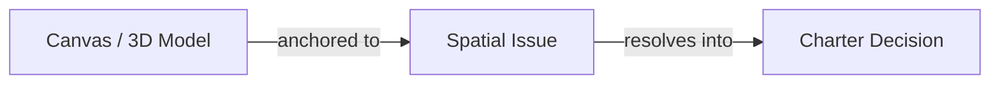

## Overview

In traditional engineering workflows, project intent, design requirements, and issue discussions live in external software decoupled from the CAD models and drawing canvas. When a design choice is made, the reasoning behind it is quickly lost, leaving future contributors and automated tools unable to understand *why* the project state exists.

`.duc` solves this by embedding both the **Project Charter** and **Spatial Issues** directly inside the SQLite database container. 

---

## Core Philosophy: Less Noise, More Clarity

Both the Charter and Issues systems are designed around a single guiding principle: **doing more with less**.

Enterprise management tools often introduce bloated status dropdowns, heavy process overhead, and administrative clutter. In contrast, `.duc` packs project intent and issue tracking into compact, lightweight data structures:

- **Minimal Status Sets**: Rather than complex state machines, Charters cycle through four non-linear phases (`intent`, `review`, `delivery`, `closed`), and Issues use three simple statuses (`open`, `closed`, `dismissed`).
- **Signal Over Noise**: By eliminating unnecessary metadata clutter, engineering teams gain immediate clarity on project objectives, hard constraints, and open design questions.

---

## The Project Charter: Reasoning Anchor

Grounded in ISO 21500/21502 project management standards, the **Project Charter** serves as the identity and reasoning anchor for the entire document.

Every requirement, constraint, and decision in a `.duc` file traces back to the Charter's core fields:

```ts
export interface DucCharter {
  title: string;
  /** Why this project exists and what concrete outcome it must reach */
  objective: string;
  phase: DucCharterPhase; // "intent" | "review" | "delivery" | "closed"
  requirements: DucCharterRequirement[];
  constraints: DucCharterConstraint[];
  decisions: DucCharterDecision[];
  stakeholders?: Array<{ actor: Actor; role: string }>;
  updatedAt: number;
}
```

### 1. Requirements & Acceptance Criteria (`DucCharterRequirement`)
Requirements define what the delivered outcome must do or be, not how to build it or what work is in scope:
- **`must: true`**: Non-negotiable requirements. Failure to satisfy this requirement fails the project.
- **`must: false`**: Strong preferences that do not block project execution if unmet.
- **`acceptanceCriteria`**: Concrete, testable statements that define verifiable completion.

### 2. Solution Constraints (`DucCharterConstraint`)
Constraints define limiting conditions that bound the allowable solution space, including technical limits, regulatory bounds, and explicit scope exclusions:
- **`hard: true`**: Non-negotiable boundaries that cannot be violated under any circumstance.
- **`hard: false`**: Soft preferences that can be revisited with documented justification.

### 3. Decision Log (`DucCharterDecision`)
A Charter Decision records a resolved choice significant enough to explain the current design direction:
- **`accepted: true`**: Choice is actively in effect.
- **`accepted: false`**: Choice was considered and explicitly rejected (kept for historical traceability so teams don't re-debate discarded options).
- **`rationale`**: Stated reasoning, alternatives considered, and accepted consequences.
- **`issueIds`**: Traceable links to the issue threads that informed the decision.

---

## Issues & The Carrot Methodology

While the Charter holds resolved project direction, **Issues** hold open questions, feedback, technical concerns, and the discussion thread that resolves them.

```ts
export interface DucIssue {
  id: string;
  localId: number; // Displayed as #1, #2, etc.
  title: string;
  status: DucIssueStatus; // "open" | "closed" | "dismissed"
  messages: DucIssueMessage[];
  anchor?: DucIssueAnchor;
  authorId: Actor["identifier"];
  createdAt: number;
}
```

### The Carrot Methodology: Tying Discussion to Geometry
Under the **Carrot methodology**, issue tracking is stripped of administrative overhead and anchored directly onto the physical project geometry using `DucIssueAnchor`:

1. **Canvas Anchoring (`type: "canvas"`)**: Pins an issue to an exact 2D coordinate `(x, y)` and measurement unit `scope` on the drawing surface.
2. **Element Anchoring (`type: "element"`)**: Attaches an issue directly to a specific 2D element ID and local element anchor point `(anchorX, anchorY)`.
3. **3D Model Anchoring (`type: "model"`)**: Pins an issue to a 3D CAD/BREP model element, storing:
   - `point`: 3D coordinates in the model's native units.
   - `normal`: Surface normal vector to orient visual markers away from geometry.
   - `viewerState`: Saved camera inspection angle, zoom, and orientation so reviewers see the exact view context where the issue was raised.
   - `topologyId`: Stable CAD/BREP/IFC topology identifier for persistent geometric tracking.

> 🥕 **Why the name "Carrot"?** While designing issue status badges in Scopture, we assigned orange to `open`, green to `closed`, and greenish-grey to `dismissed`. We accidentally realized the color palette matched a carrot and placing an uncollected issue pin on the canvas felt just like a carrot planted in the soil waiting to be harvested.

---

## Decision Traceability Across the Canvas

The integration of Charter and Issues creates complete **decision traceability**:



1. An engineer or reviewer identifies a problem directly on the drawing canvas or 3D model and opens a **Spatial Issue**.
2. Team members discuss options within the issue message thread (`messages`).
3. When consensus is reached, the issue resolves into an accepted or rejected **Charter Decision**, linking the issue ID for full historical context.

Without Charter and Issues embedded directly inside `.duc`, project development becomes decoupled from the canvas, decision traceability breaks down, and the physical CAD model loses its reasoning anchor.