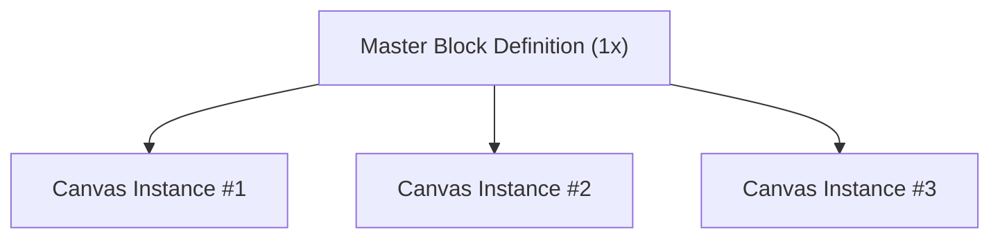
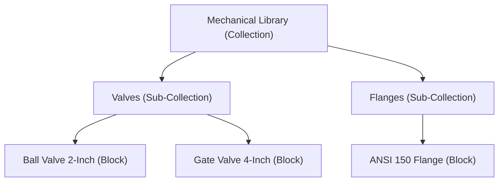

## 1. What is a Block? (The Master Definition)

A **Block** (`DucBlock`) is an **authoritative, reusable definition of a set of elements**.

- **Single Source of Truth**: There is **only ONE master Block definition of a kind** stored in the document's block registry.
- **Blueprint**: A Block defines the geometry, visual styles, and spatial arrangement of a reusable component.

---

## 2. What is a Block Instance?

A **Block Instance** (`DucBlockInstanceElement`) is a live spatial reference placed on the drawing canvas that derives its geometry and layout from a master Block definition.

- **One-to-Many Relationship**: While a document contains only one master Block definition, **multiple instances** can be placed across the canvas relative to that single block.
- **Automatic Synchronization**: When the master Block definition is updated, **all live instances will automatically synchronize** to reflect the design change instantly.

---

## 3. Instance Overrides

- **Granular Customization**: An instance can override specific properties of its inner elements without detaching from the master Block.
- **Selective Synchronization**: When the master Block is modified, all non-overridden properties of every instance update automatically, while individual instance overrides are preserved.

---

## 4. Duplication Arrays

- **Pattern-Based Replication**: A single block instance can define a linear or grid duplication array with specified counts and spatial offsets.
- **Unified Management**: The entire array is managed as a single logical entity, automatically rendering repeated instances across calculated spatial offsets while remaining fully synchronized with the master Block definition.

---

## 5. Block Collections

As engineering projects grow to contain hundreds of reusable blocks, organizing these assets becomes critical.

A **Block Collection** (`DucBlockCollection`) is an organizational folder or pocket of blocks:

- **Not Canvas Groups**: Unlike visual groups on the canvas (`groupIds`), a Collection is a structural data organization hierarchy within the document container.
- **Nested Folder Structures**: Collections can contain blocks and sub-collections, allowing engineering teams to build clean, categorized asset libraries directly inside the `.duc` file.
