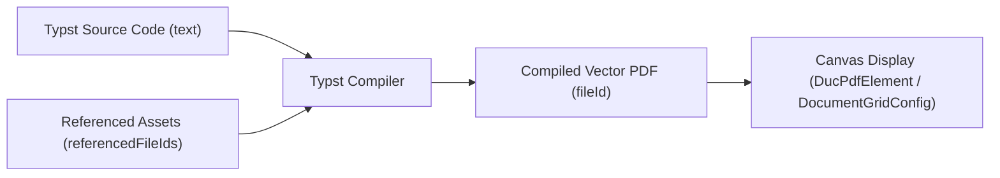

## Overview

In `.duc`, a **Document Element** (`DucDocElement` with `type: "doc"`) embeds full multi-page document deliverables (technical specifications, research papers, engineering reports) directly on the canvas.

Unlike simple text labels, a Document Element provides a compiled typesetting environment that produces publication-ready PDF document deliverables directly inside the `.duc` file format.

---

## Document Element vs. Text Element

| Feature | Text Element (`DucTextElement`) | Document Element (`DucDocElement`) |
| :--- | :--- | :--- |
| **Primary Purpose** | Pure text canvas annotations | Multi-page technical documents, papers, and deliverables |
| **Source Syntax** | Plain text or basic formatted strings | Typst markup source code |
| **Output Render** | Direct canvas vector text rendering | Compiled vector PDF document rendering |
| **Asset References** | None | Attached external images, figures, and datasets (`referencedFileIds`) |

---

## Typst as the Source Code of Truth

A Document Element stores its source content in the `text` attribute as **Typst** markup code:

```ts
export type DucDocElement = _DucElementBase & {
  type: "doc";
  text: string; // Typst markup source code
  fileId: ExternalFileId | null; // Compiled PDF output file reference
  referencedFileIds: ExternalFileId[]; // Images, figures, or data files referenced in Typst
  gridConfig: DocumentGridConfig; // Page grid layout configuration
};
```

[Typst](https://typst.app/docs/) is a modern, markup-based document typesetting language designed as a fast alternative to LaTeX. Storing Typst markup in `text` ensures that document source code remains text-based, version-controllable, and inspectable inside the `.duc` data structure.

---

## PDF Compilation & Canvas Visualization

The visual rendering of a Document Element is produced by compiling its Typst source code into a PDF:



### Canvas Behavior as a PDF Element (`DucPdfElement`)

Once compiled, a Document Element renders on the canvas using the exact same page layout and spatial grid mechanics as a standalone **PDF Element** (`DucPdfElement`). 

Both `DucDocElement` and `DucPdfElement` share the `DocumentGridConfig` data structure to control multi-page canvas rendering.

```ts
export type DocumentGridConfig = {
  columns: number; // Number of page columns
  gapX: number; // Horizontal spacing between columns (px)
  gapY: number; // Vertical spacing between rows (px)
  firstPageAlone: boolean; // Standalone cover page behavior
  scale: number; // Unitless physical scale ratio (Drawing / Real-World)
};

export type DucPdfElement = _DucElementBase & {
  type: "pdf";
  fileId: ExternalFileId | null;
  gridConfig: DocumentGridConfig;
};
```

---

## Page Grid & Scale Configuration (`DocumentGridConfig`)

### 1. Multi-Column Grid Flow (`columns`, `gapX`, `gapY`)

- **`columns`**: Defines the number of page columns (for example, `1` for single column, `2` for two-up, or `N` for grid layouts). Pages flow left-to-right across the specified columns, wrapping into subsequent rows based on total page count.
- **`gapX`**: Defines horizontal spacing between columns.
- **`gapY`**: Defines vertical spacing between rows.

### 2. Standalone Cover Page (`firstPageAlone`)

When `firstPageAlone` is set to `true`, the first page of the document renders standalone centered at the top as a dedicated cover row. Remaining pages flow below across the specified column grid.

### 3. Physical PDF Scale Ratio (`scale`)

PDF documents follow ISO paper standards (such as A4, A3, or A0) with real-world physical dimensions.

- **Unitless Scale Ratio**: The `scale` attribute stores the unitless scale ratio (`Drawing Units / Real World Units`, for example `1:40` => `0.025`, `1:100` => `0.01`, `1:1000` => `0.001`).
- **Spatial Traceability**: Storing the physical scale factor relative to the element's canvas `scope` and dimensions preserves spatial scale traceability, allowing runtimes to reconstruct original real-world paper sizes.

---

## Document Conversion with Pandoc

Document Elements can ingest existing external document formats:

- **Supported Source Formats**: Some document formats including Microsoft Word (`.docx`), Markdown (`.md`), and OpenDocument (`.odt`) and more.

Converting external documents into Typst syntax enables existing technical reports and papers to be imported directly into `.duc` as Document Elements.
