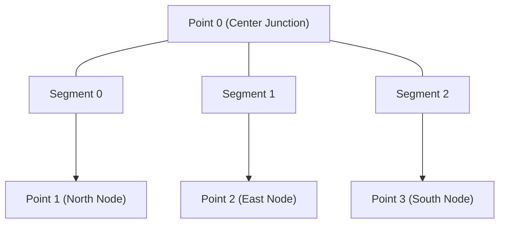

## Overview

In `.duc`, a **Linear Element** (`DucLinearElement` with `type: "line"`, or `DucArrowElement` with `type: "arrow"`) represents vector paths.

Unlike conventional graphics formats that restrict paths to simple 2-point segments or raw SVG command strings (`d="M... L... C..."`), `.duc` structures linear geometry using relational data arrays. This allows a single element to represent straight lines, polylines, smooth Bezier curves, and complex networks of interconnected line webs.

---

## Line Heads (`DucHead`)

Linear elements support visual head attachments at their start (`startBinding.head`) and end (`endBinding.head`) endpoints.

```ts
export type DucHead = {
  type: LineHead;
  blockId: string | null;
  size: number;
};
```

- **Standard Enum Heads**: Built-in geometric indicators.
- **Custom Block Heads (`blockId`)**: References a master Block definition ID to render custom architectural or engineering symbols as line heads.
- **Size Scaling (`size`)**: Proportional scaling factor for the head marker.

<iframe style={{ border: '1px solid rgba(0, 0, 0, 0.1)', borderRadius: '8px' }} width="100%" height="450" src="https://embed.figma.com/design/5rYcUlscflBabQ9di2iFJ5/duc?node-id=313-43&embed-host=share" allowFullScreen></iframe>

### Line Head Reference Table

| Enum Name | Value | Visual Description |
| :--- | :--- | :--- |
| `ARROW` | `10` | Solid filled directional arrow |
| `BAR` | `11` | Perpendicular T-bar cap |
| `CIRCLE` | `12` | Solid filled circle dot |
| `CIRCLE_OUTLINED` | `13` | Outlined hollow circle |
| `TRIANGLE` | `14` | Solid filled equilateral triangle |
| `TRIANGLE_OUTLINED` | `15` | Outlined hollow triangle |
| `DIAMOND` | `16` | Solid filled rhombus |
| `DIAMOND_OUTLINED` | `17` | Outlined hollow rhombus |
| `CROSS` | `18` | Perpendicular cross mark |
| `OPEN_ARROW` | `19` | Unfilled V-shaped open arrow |
| `REVERSED_ARROW` | `20` | Inverted directional arrow pointing backward |
| `REVERSED_TRIANGLE` | `21` | Solid inverted triangle |
| `REVERSED_TRIANGLE_OUTLINED` | `22` | Outlined inverted triangle |
| `CONE` | `23` | Solid narrow cone head |
| `HALF_CONE` | `24` | Asymmetric half-cone head |

---

## Element Binding

Linear elements can bind their endpoints (`startBinding` and `endBinding`) to target canvas elements (`DucBindableElement`).

```ts
export type DucPointBinding = {
  elementId: string;
  focus: number; // Border position offset (-1 to 1)
  gap: PrecisionValue; // Clearance distance from target border
  fixedPoint: FixedPoint | null; // Fixed normalized coordinates [x, y] inside bound element (0.0 to 1.0)
  point: {
    index: number;
    offset: number;
  } | null; // Point or segment offset when binding to a linear element
  head: DucHead | null;
};
```

- **Target Association (`elementId`)**: Binds the endpoint to a target element ID.
- **Border Focus (`focus`)**: Defines a fractional offset (`-1` to `1`) along the target element's border where the line attaches.
- **Clearance Gap (`gap`)**: Maintains a defined distance between the line head and the target element boundary.
- **Fixed Position (`fixedPoint`)**: Defines normalized internal coordinates `[x, y]` (`0.0` to `1.0`) inside the target element. When set, it overrides `focus` to pin the endpoint to a fixed location.
- **Linear Point Binding (`point`)**: Binds the endpoint to a specific vertex `index` and segment `offset` of another linear element.
- **Dynamic Updates**: When a target element moves, rotates, or scales, bound linear elements re-evaluate endpoint positions and update their geometry automatically.

---

## How Linear Path Geometry is Constructed

Path geometry in `.duc` is composed of two relational arrays:
1. **`points: DucPoint[]`**: Array of discrete spatial vertices `[Point 0, Point 1, Point 2, ...]`.
2. **`lines: DucLine[]`**: Array of line segment connections referencing point indices `[startReference, endReference]`.

```ts
export type DucLine = [DucLineReference, DucLineReference];

export type DucLineReference = {
  index: number; // Index of the target point in the points array
  handle: DucPointPosition | null; // Bezier control handle (null for sharp straight connections)
};
```

Here is how different linear path geometries are constructed step-by-step:

### Step 1: Constructing a Straight Line Segment

To construct a straight line segment between two vertices, define two points in `points` and connect their indices in `lines` with `handle: null` on both ends.

```ts
const straightLine: DucLinearElement = {
  type: "line",
  points: [
    { x: { value: 0 }, y: { value: 0 } },   // Point Index 0
    { x: { value: 100 }, y: { value: 0 } }  // Point Index 1
  ],
  lines: [
    [
      { index: 0, handle: null }, // Start at Point 0 (no outgoing handle)
      { index: 1, handle: null }  // End at Point 1 (no incoming handle)
    ]
  ],
  // ... base element properties
};
```

---

### Step 2: Constructing Curved Bezier Paths (Single-Handle & Dual-Handle)

In `.duc`, Bezier control handles on a line segment are **independent per endpoint**. A line segment does not require handles on both ends.

Control handles define path curvature:
- **`start.handle` (`handleOut`)**: Outgoing control handle extending from the start point toward the end point.
- **`end.handle` (`handleIn`)**: Incoming control handle extending into the end point from the start point.

#### A. Single-Handle Bezier Segments (`handle: null` on one end)

A segment can have `handle: null` on one end and a populated control handle on the other:

1. **`start.handle = null` and `end.handle = { x, y }`**: The line leaves Point 0 cleanly without an outgoing handle, but curves into Point 1 via an incoming control handle (`handleIn`).
2. **`start.handle = { x, y }` and `end.handle = null`**: The line leaves Point 1 via an outgoing control handle (`handleOut`), but enters Point 2 cleanly as a sharp connection without an incoming handle.

#### B. Complete Curved Path Example with Mixed Handles

Here is a 4-point closed path demonstrating mixed single-handle and dual-handle Bezier segments:

```ts
const bezierPath: DucLinearElement = {
  type: "line",
  points: [
    { x: { value: 0 }, y: { value: 0 } },                      // Point 0
    { x: { value: -35 }, y: { value: 80 }, mirroring: 12 },    // Point 1 (Symmetric Mirroring)
    { x: { value: 10 }, y: { value: 130 } },                    // Point 2
    { x: { value: 50 }, y: { value: 95 }, mirroring: 12 }      // Point 3 (Symmetric Mirroring)
  ],
  lines: [
    // Segment 0: Point 0 -> Point 1
    // Point 0 has handle = null; Point 1 has an incoming handle (handleIn)
    [
      { index: 0, handle: null },
      { index: 1, handle: { x: { value: -25 }, y: { value: 60 } } }
    ],

    // Segment 1: Point 1 -> Point 2
    // Point 1 has an outgoing handle (handleOut); Point 2 has handle = null
    [
      { index: 1, handle: { x: { value: -20 }, y: { value: 95 } } },
      { index: 2, handle: null }
    ],

    // Segment 2: Point 2 -> Point 3
    // Point 2 has handle = null; Point 3 has an incoming handle (handleIn)
    [
      { index: 2, handle: null },
      { index: 3, handle: { x: { value: 35 }, y: { value: 140 } } }
    ],

    // Segment 3: Point 3 -> Point 0 (Closing Loop)
    // Point 3 has an outgoing handle (handleOut); Point 0 has handle = null
    [
      { index: 3, handle: { x: { value: 60 }, y: { value: 45 } } },
      { index: 0, handle: null }
    ]
  ]
};
```

#### Bezier Mirroring Modes (`mirroring`)

When a point connects two curved segments, `mirroring` controls handle symmetry during edits:
- **`NONE` (`10`)**: Handles move independently, creating sharp corners or asymmetrical curves.
- **`ANGLE` (`11`)**: Handles mirror rotation angle, while handle lengths vary independently.
- **`ANGLE_LENGTH` (`12`)**: Handles mirror both rotation angle and length symmetrically, producing smooth continuous curves.

---

### Step 3: Constructing a Polyline or Closed Shape

Multiple line segments can be chained together across sequential point indices to construct a polyline or closed loop:

```ts
const closedTriangle: DucLinearElement = {
  type: "line",
  points: [
    { x: { value: 0 }, y: { value: 0 } },   // Point Index 0
    { x: { value: 100 }, y: { value: 0 } }, // Point Index 1
    { x: { value: 50 }, y: { value: 80 } }  // Point Index 2
  ],
  lines: [
    [{ index: 0, handle: null }, { index: 1, handle: null }], // Segment 0: Point 0 -> Point 1
    [{ index: 1, handle: null }, { index: 2, handle: null }], // Segment 1: Point 1 -> Point 2
    [{ index: 2, handle: null }, { index: 0, handle: null }]  // Segment 2: Point 2 -> Point 0 (Closed Loop)
  ],
  // ... base element properties
};
```

---

### Step 4: Constructing a Complex Web or Network

Unlike SVG paths that must follow a single continuous sequence of points, `.duc` allows multiple lines in the `lines` array to reference the exact same point index.

This enables a single Linear Element to represent a T-junction, star network, or interconnected web of lines:



```ts
const tJunctionNetwork: DucLinearElement = {
  type: "line",
  points: [
    { x: { value: 50 }, y: { value: 50 } },  // Point Index 0 (Center Junction)
    { x: { value: 50 }, y: { value: 0 } },   // Point Index 1 (North Node)
    { x: { value: 100 }, y: { value: 50 } }, // Point Index 2 (East Node)
    { x: { value: 50 }, y: { value: 100 } }  // Point Index 3 (South Node)
  ],
  lines: [
    [{ index: 0, handle: null }, { index: 1, handle: null }], // Branch 1: Center -> North
    [{ index: 0, handle: null }, { index: 2, handle: null }], // Branch 2: Center -> East
    [{ index: 0, handle: null }, { index: 3, handle: null }]  // Branch 3: Center -> South
  ],
  // ... base element properties
};
```

---

## Additional Path Properties

- **`pathOverrides` (`DucPath[]`)**: Overrides background and stroke properties for specific sub-paths within a line network.
- **`wipeoutBelow`**: Boolean flag on `DucLinearElement` that masks out underlying canvas content beneath the stroke path.
