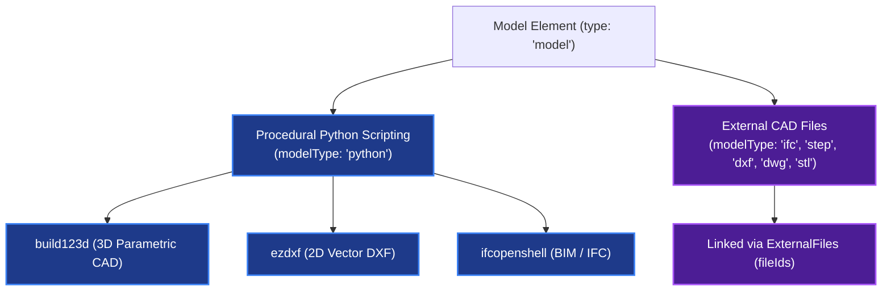

## Overview

In `.duc`, a **Model Element** (`DucModelElement` with `type: "model"`) is the only element that can produce an interactive 3D model. It can also represent interactive 2D CAD content such as DXF and DWG, so the element is broader than 3D even though no other element type provides the interactive 3D capability.

The element connects executable Python or an external CAD payload to its position on the 2D canvas, cached preview or thumbnail, and persistent `viewerState`. A valid model record is therefore not only code or a file attachment: its source must produce geometry that the host can collect and render.

---

## Dual Model Source Paradigms

A Model Element can derive its geometry from two distinct sources (`modelType`):



### 1. Procedural Python Scripting (`modelType: "python"`)

When set to `modelType: "python"`, the element stores Python source code in `code`. Scopture executes that source in its Python model runtime when it needs an interactive preview or generated model file. `ducpy` can validate embedded source while serializing, but serialization itself does not create the interactive preview.

The runtime supports three output pipelines:

- **`build123d`**: Parametric 3D CAD modeling (solids, extrusions, sweeps, fillets, boolean operations).
- **`ezdxf`**: 2D DXF vector drawing generation.
- **`ifcopenshell`**: Open-standard Building Information Modeling (BIM) data structures.

For a Python Model Element, the **first recognized CAD import in the source selects the output pipeline**. Imports inside comments are ignored.

| First recognized import | Selected output | What the script must expose |
| :--- | :--- | :--- |
| `build123d` or `ocp_vscode` | Parametric preview | One or more renderable Build123d/OCP objects passed to `show(...)` |
| `ifcopenshell` | IFC preview | An `ifcopenshell.file` containing products with renderable geometry |
| `ezdxf` | DXF model file | An `ezdxf.document.Drawing` available at module scope or explicitly saved |

This order is significant. For IFC Python, place `import ifcopenshell` **before** `from ocp_vscode import show`; otherwise `ocp_vscode` selects the parametric pipeline before the runtime reaches the IFC import.

#### Build123d output contract

Use the Build123d import as the header and finish by passing the completed object or objects to `show(...)`:

```python
from build123d import Box
from ocp_vscode import show

# Build the intended geometry.
result = Box(1, 1, 1)

# Required terminal output for the interactive preview.
show(result)
```

Scopture replaces `ocp_vscode.show` with a compatible collector that tessellates the supplied objects into the preview payload. Merely assigning a shape to a variable or printing it does not emit that payload.

#### IfcOpenShell output contract

Start with the IfcOpenShell import so the runtime selects IFC collection. Keep the completed `ifcopenshell.file` at module scope and pass it to `show(...)`:

```python
import ifcopenshell
from ocp_vscode import show

# Create or open an IFC model and add products with geometric representations.
model = ifcopenshell.file(schema="IFC4")

# Marks this IFC file as the intended interactive model.
show(model)
```

The collector can discover a module-level `ifcopenshell.file`, while `show(model)` identifies the intended file explicitly. An IFC project hierarchy without product geometry is valid IFC data but cannot produce a meaningful 3D preview.

#### ezdxf output contract

Start with `import ezdxf` and retain the completed drawing at module scope:

```python
import ezdxf

drawing = ezdxf.new()
modelspace = drawing.modelspace()

# Add the intended DXF entities to modelspace.
```

After execution, Scopture discovers the module-level `ezdxf.document.Drawing` and serializes it as the generated DXF model file. Calling `drawing.saveas(...)` is also supported, but is not required for collection. Printing entity counts does not produce a model output.

#### Using external files from Python

A Python model may use `fileIds` as runtime dependencies. Resolve a linked file by its DUC external-file ID rather than assuming a host filesystem path:

```python
MODEL_FILE_ID = "linked-file-id"
MODEL_PATH = resolve_external_file(MODEL_FILE_ID)
```

The same ID must appear in the Model Element's `fileIds`, and the corresponding External File revision must contain the payload. `resolve_external_file(...)` returns the sandbox-local mounted path. This pattern can be used with `ifcopenshell.open(...)`, `ezdxf.readfile(...)`, and Build123d import functions.

#### Why successful Python can still fail to render

`Python compile succeeded but no preview payload was produced` means the source executed without raising an exception, but the selected pipeline did not receive a renderable output. The usual causes are:

- Build123d code created geometry but never called `show(...)`.
- `from ocp_vscode import show` appeared before `import ifcopenshell`, selecting the parametric pipeline for IFC code.
- IFC code did not leave a usable `ifcopenshell.file`, or the file contained no renderable product geometry.
- A Python dependency ID was missing from `fileIds`, so the required external payload was not mounted.

For ezdxf, the equivalent failure reports that no DXF file was produced. It occurs when the script prints or inspects entities but does not leave an `ezdxf.document.Drawing` at module scope or save it.

### 2. External Binary CAD Files (`modelType: "ifc" | "step" | "dxf" | "dwg" | "stl"`)

When the model comes directly from a CAD file, set `modelType` to the file format and link the source payload through `fileIds`. Embedded Python syntax is not required for this source mode.

Supported file formats include:
- **`IFC`**: Architectural and building information models.
- **`STEP` (`.step`, `.stp`)**: Precise boundary representation (BREP) 3D CAD solids.
- **`DXF` / `DWG`**: 2D vector CAD drawings.
- **`STL`**: 3D surface mesh geometry.

The external-file contract is:

1. Store the file bytes and revision metadata in a DUC External File.
2. Add that External File's ID to the Model Element's `fileIds`.
3. Set `modelType` to `ifc`, `step`, `stl`, `dxf`, or `dwg`.

For IFC, STEP, and STL, Scopture opens the linked source through the corresponding model adapter and generates the interactive preview. DXF is rendered as 2D CAD data; DWG is converted to a cached DXF representation for rendering while the original DWG remains the source file. Runtime caches or generated previews may also be referenced internally, but they do not replace the source External File.

`fileIds` has different semantics in the two source modes: for an external model it identifies the model source, while for `modelType: "python"` it identifies files that the script may open through `resolve_external_file(...)`.

---

## Bridging 3D Depth to the 2D Canvas via `viewerState`

Physical engineering review and project documentation rely on 2D projections (plans, elevations, sections, and callouts).

The Model Element handles 3D spatial geometry by storing an explicit 3D camera projection state inside its `viewerState` attribute.

```ts
export type DucModelElement = _DucElementBase & {
  type: "model";
  modelType: string | null;
  code: string | null;
  thumbnail: Uint8Array | null;
  fileIds: ExternalFileId[];
  viewerState: Viewer3DState | null;
};
```

### The 3D Viewer State Data Structure (`viewerState`)

The `viewerState` field records spatial camera and projection parameters:

- **Camera Spatial State**: Camera position coordinates, target focus point, quaternion rotation, and zoom scale.
- **Projection Mode**: Orthographic versus perspective projection settings.
- **Orientation Presets**: Standard view direction indicators (Top, Bottom, Front, Back, Left, Right, Isometric).
- **Section Clipping**: Active 3D cross-section clipping plane definitions along X, Y, and Z axes.
- **Material & Analysis Settings**: Surface lighting parameters, metalness, roughness, and zebra line reflection analysis modes.

By storing `viewerState` directly inside the element record, `.duc` preserves an exact 3D spatial viewpoint projection on the 2D canvas, allowing runtimes to render the defined perspective while maintaining complete 3D spatial parameters in the file format.

---

## Stored Model State

Model Elements preserve the source and presentation state needed to reproduce their view:

- **Procedural Source**: Python model code remains executable and can be re-evaluated after its variables or linked dependencies change.
- **External Source Revisions**: External CAD payloads remain attached through `fileIds` and retain their DUC revision metadata.
- **Interactive Presentation**: `viewerState` preserves the camera, projection, clipping, and material settings independently from the model source.
