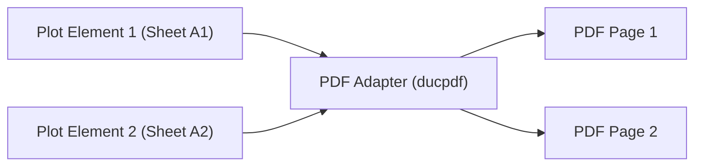

## Overview

In `.duc`, a **Plot Element** (`DucPlotElement` with `type: "plot"`) defines a finite paper space boundary within the infinite canvas.

While drawings and geometry span across continuous canvas space, physical deliverables require explicit boundaries. A Plot Element establishes defined page dimensions, margins, and clipping bounds for printing, plotter outputs, and multi-page PDF generation.

---

## Plot Element vs. Frame Element

Both Plot Elements and Frame Elements inherit from a shared container foundation (`_DucStackElementBase`), but serve distinct roles:

| Feature | Frame Element (`DucFrameElement`) | Plot Element (`DucPlotElement`) |
| :--- | :--- | :--- |
| **Primary Role** | Canvas organization, artboard grouping, and visual framing | Export configuration, deliverability, and printable page boundaries |
| **Canvas Behavior** | Groups elements for spatial layout and viewport navigation | Captures enclosed elements for file export and paper printing |
| **Layout Attributes** | Visual border styles and group metadata | Paper layout dimensions and explicit margins (`layout`) |

---

## Export Integration with the PDF Adapter (`ducpdf`)

The Plot Element functions as the primary export target when compiling `.duc` documents into external files.

When a document is exported via the [`ducpdf`](/docs/pdf/overview) adapter:



1. **Page Mapping**: Each Plot Element defined on the canvas compiles into an individual page within the generated PDF deliverable.
2. **Boundary Capture**: Enclosed canvas elements positioned within a Plot Element's spatial region are captured, clipped to the defined paper margins, and rendered onto that plot's PDF page.
3. **Multi-Page Deliverables**: A single `.duc` canvas containing multiple Plot Elements exports directly into a structured multi-page PDF document set.

---

## Plot Layout and Paper Margins (`PlotLayout`)

The spatial paper composition of a Plot Element is governed by its `layout` attribute:

```ts
export type PlotLayout = {
  margins: {
    top: PrecisionValue;
    right: PrecisionValue;
    bottom: PrecisionValue;
    left: PrecisionValue;
  };
};

export type DucPlotElement = _DucStackElementBase & {
  type: "plot";
  layout: PlotLayout;
};
```

- **Paper Dimensions**: The element's canvas `width` and `height` correspond directly to physical paper size dimensions.
- **Margin Insets (`margins`)**: Specifies explicit `top`, `right`, `bottom`, and `left` margin insets (`PrecisionValue`), defining printable boundary limits for enclosed elements.
