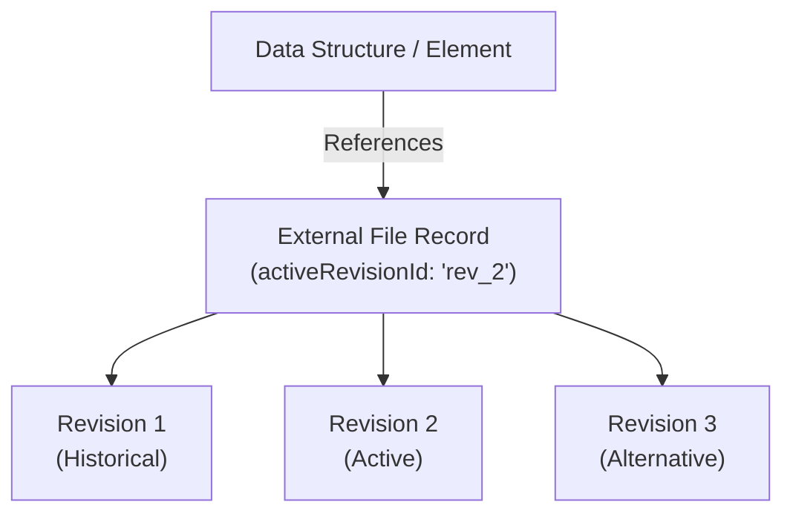

## Overview

Data structures across a `.duc` container (such as image elements, 3D model elements, vector PDF overlays, block definitions, project charters, or version checkpoints) frequently depend on binary files to function.

Embedding raw binary payloads directly inside structural records bloats document state and tightly couples data structures to binary payloads. `.duc` handles binary payload storage through **External Files** and **Deliberate Revisions**.

---

## Decoupling Payloads from Data Structures

An External File (`DucExternalFile`) acts as a dedicated storage container inside the database schema. Canvas elements, block definitions, and other data structures store only an `ExternalFileId` reference rather than embedding binary data directly.

### Separation of Concerns

1. **Structural Identity**: The referencing element or data structure maintains its coordinates, properties, attached issues, and charter links.
2. **Payload Storage**: The external file container stores the raw binary payload itself, independent of how any single referencing record is structured.

This separation allows any data structure in `.duc`, not just canvas elements, to attach binary assets without altering its own record format or spatial identity.

---

## Manual Revisions and Active Pointer

File updates in `.duc` are managed through **Revisions** (`revisions`).

### Deliberate Revision Triggers

Revisions are not generated automatically on every minor edit or save. A revision is created only when a user or application explicitly adds one to an external file. This is a deliberate design choice: it keeps the revision history limited to points in a file's life that were actually worth marking, a review, a delivery, a milestone, rather than every incidental change made along the way.

### Active Revision Selection (`activeRevisionId`)

Adding a new revision does not automatically make it the active one. The most recent revision and the active revision are two separate ideas:

- **Explicit Active Pointer**: Each external file record stores an explicit `activeRevisionId`, which determines which revision is actually in use, regardless of which revision was added most recently.
- **Flexible Switching**: Users can switch or pin `activeRevisionId` to any revision in the file's history without deleting newer or older revisions.
- **Identity Preservation**: Switching `activeRevisionId` updates the rendered or evaluated asset while preserving all element IDs, annotations, and spatial coordinates intact.

---

## External Files vs. Enterprise PLM and Cloud Storage

External Files in `.duc` are designed to provide context to document structures, not to serve as an enterprise file centralization system.

It's tempting to describe the difference as "manual" versus "automatic" versioning, but that's not really the distinction that matters, plenty of PLM systems also rely on deliberate check-ins rather than continuous sync. The real difference is one of **purpose and selectivity**: what each system is trying to capture, and how much of a file's history it's willing to keep.

| System Type | Purpose | What Gets Kept |
| :--- | :--- | :--- |
| **Enterprise PLM / Cloud Drive** | Centralized repository for organizing and tracking file assets across an entire team or organization | A comprehensive record of a file's history, most edits and drafts along the way |
| **`.duc` External Files** | Provides binary payload context to a specific document data structure | Only the revisions deliberately chosen as meaningful checkpoints for that structure |

A PLM system exists because an organization needs a durable way to manage files across many people and processes over time. External Files exist for a narrower reason: so that a binary asset can be referenced from anywhere in the `.duc` data model, and so that reference can point to an explicit, known state of that file at a point in time. The revisions kept on a given external file are typically a small fraction of everything a PLM system would track for the same file, only the states that were worth carrying into review, iteration, or delivery make the cut.

`.duc` External Files are not a replacement for PLM or cloud storage, and are not meant to compete with either. The two are solving different problems.

In short, **external files and revisions exist for relational context, not for data centralization.**