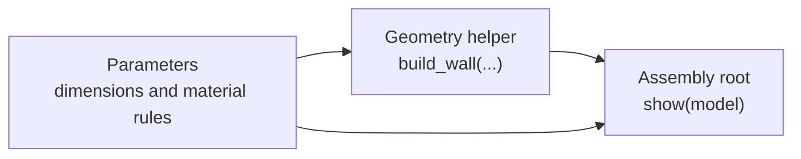

## Models as a Dependency Graph

A Python [Model Element](/docs/concepts/elements/model-element) does not need to render geometry by itself. It can instead be a reusable module that exposes parameters, functions, standards, or domain logic to other Model Elements.

This changes a large procedural model from one monolithic script into a dependency graph:



The leaf and intermediate elements may have no visual output. The root element imports them, composes the final object, and satisfies the relevant Build123d, IfcOpenShell, or ezdxf output contract.

## The `duc_model` Package

Compatible hosts expose referenced Python Model Elements as lazy modules under the virtual `duc_model` package. An import is resolved from Model Elements in the same drawing rather than from a file on the host filesystem.

The preferred form imports only the required public names:

```python
from duc_model.mmBUBjTesxYfxL0HDjXWg import width, height
```

Importing the module is also supported:

```python
import duc_model.mmBUBjTesxYfxL0HDjXWg as dimensions

area = dimensions.width * dimensions.height
```

Dependencies are loaded when Python imports them and each referenced element executes once per root execution. A dependency may import another Model Element, allowing the host to resolve the complete transitive closure. Keep the graph acyclic and use ordinary explicit imports; dynamic imports cannot be reliably discovered before execution.


## Separate Configuration, Logic, and Output

A useful module boundary assigns one responsibility to each Model Element.

### Parameters

```python
# Element ID: mmBUBjTesxYfxL0HDjXWg
width = 120
height = 80
wall_thickness = 5
```

### Geometry helper

```python
# Element ID: model_wall_geometry
from duc_model.mmBUBjTesxYfxL0HDjXWg import width, height, wall_thickness
from build123d import Box

def build_wall():
    return Box(width, wall_thickness, height)
```

### Rendering root

```python
from duc_model.model_wall_geometry import build_wall
from ocp_vscode import show

model = build_wall()
show(model)
```

Only the rendering root should own the final `show(...)` call or generated-file output. Imported modules should expose data and callable building blocks. This keeps previews deterministic and allows the same parameter or geometry module to serve several assemblies.

## Change Propagation

The dependency relationship is encoded in Python source, while each module remains a normal Model Element with its own ID and `code`. A runtime that caches compiled geometry or thumbnails should include the complete transitive module graph in its content identity. Changing a shared parameter element must invalidate every dependent root, not only the edited element.

This separation is especially useful for:

- one set of project dimensions driving multiple assemblies;
- shared material, tolerance, or fabrication rules;
- reusable geometry factories with several rendering roots;
- logic-only elements that make domain rules inspectable without adding canvas output; and
- focused version review, where a small source change has an explicit downstream dependency path.

Modularization does not change the stored `DucModelElement` shape: source remains in each element's `code`, external runtime files remain in `fileIds`, and presentation state remains in `viewerState`. The module graph is reconstructed from the explicit `duc_model` imports.
