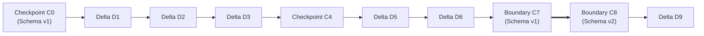

## Overview

In traditional engineering workflows, version control is either completely missing or relegated to external tools that treat complex CAD files as black-box binary blobs. This leads to lost work, broken file states, and an inability to inspect historical design decisions.

`.duc` solves this by embedding a native **Version Graph (DAG)** directly inside the SQLite database container (`version_graph`, `version_chains`, `checkpoints`, `deltas`). 

---

## Core Philosophy: Safety & Efficiency

The Version Graph balances two fundamental engineering imperatives:

1. **Absolute Traceability & Safety**: Full-state **Checkpoints** capture self-contained snapshots of the entire project state, guaranteeing zero data corruption.
2. **Extreme Storage Efficiency**: Lightweight **Deltas** leverage SQLite changeset generation paradigms to record incremental edits with minimal file overhead.



---

## Checkpoints: Unbreakable Safety Pivots

A **Checkpoint** (`C`) is a complete, self-contained snapshot of the entire document state at a specific version (`version_number`).

```ts
export interface Checkpoint {
  id: string;
  parentId?: string;
  chainId: string;
  versionNumber: number;
  schemaVersion: number;
  timestamp: number;
  isManualSave: boolean;
  isSchemaBoundary: boolean;
  dataChecksum: string; // SHA-256 of snapshot bytes
}
```

### Key Properties of Checkpoints

- **Standalone Recovery**: Every checkpoint is 100% self-contained. It can be loaded independently to reconstruct the exact document state without relying on prior versions or external files.
- **Cryptographic Integrity**: Verified via a SHA-256 `data_checksum` during restore operations to guarantee snapshot data remains uncorrupted.
- **Pivot Anchors**: Checkpoints serve as the base pivot for subsequent deltas, preventing diff chains from growing endlessly long.
- **Schema Migration Boundaries (`is_schema_boundary = 1`)**: When the `.duc` file format undergoes a schema upgrade, a boundary checkpoint is automatically generated in both the old and new schema (`schema_migrations`). This ensures historical snapshots remain permanently readable decades into the future.

---

## Deltas: Hyper-Compact Changesets

A **Delta** (`D`) is an incremental patch that records only the modified elements, geometric changes, or state updates since the last checkpoint.

```ts
export interface Delta {
  id: string;
  parentId?: string;
  baseCheckpointId: string; // The pivot checkpoint anchor
  deltaSequence: number;    // Ordinal sequence relative to base checkpoint
  versionNumber: number;
  schemaVersion: number;
  changesetChecksum: string;
}
```

### Engineering Behind Deltas

- **SQLite Delta Generation**: Deltas leverage SQLite's core changeset generation paradigms combined with compression to calculate exact relational diffs.
- **Pivot Reference**: Each delta references its `base_checkpoint_id` (the pivot checkpoint) and its `delta_sequence` position.
- **Minimal File Overhead**: Storing diffs relative to a pivot checkpoint keeps delta file sizes down to a few kilobytes, even during intense editing sessions with thousands of spatial updates.
- **Schema Isolation**: Deltas never cross schema boundaries, they execute sequentially from their designated base checkpoint.

---

## The Version Graph DAG

The version control system operates as a Directed Acyclic Graph (DAG), enabling non-linear history, branching, and user-designated save points:

- **`version_graph`**: Singleton control table tracking `current_version`, `current_schema_version`, `user_checkpoint_version_id` (manual save points), and `latest_version_id`.
- **`version_chains`**: Groups contiguous version sequences that share the same schema version.
- **Parent Lineage (`parent_id`)**: Both checkpoints and deltas maintain parent pointers, supporting visual version graph inspection and branch traversal.

---

## Restoration & Replay Algorithm

To restore any target version `N` across the version graph, the engine executes a deterministic 3-step algorithm:

1. **Locate Pivot Checkpoint**: Query the nearest checkpoint `C` where `C.version_number <= N` in the target schema.
2. **Hydrate Base State**: Load base checkpoint `C` chunks from `checkpoint_data_chunks` (instant full-state hydration).
3. **Replay Delta Sequence**: Sequentially apply deltas `D_1, D_2, ...` matching `C.id` in `delta_sequence` order up to version `N`.

This hybrid architecture guarantees **instant loading performance**, **unbreakable data safety**, and **minimal file storage overhead**.
