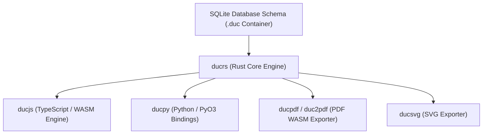

## Overview

While the SQLite database schema defines the relational container format and schema, `ducrs` implements the core engine logic for binary parsing, gzip envelope decompression, DAG version control, chunk streaming, and serialization.

---

## Foundational Architecture

Every ecosystem SDK and adapter builds directly on top of `ducrs`:

- **Core Engine Foundation**: `ducrs` serves as the primary implementation of all binary container operations, validation rules, and schema migrations.
- **Python Bindings (`ducpy`)**: Exposes native CPython extension modules compiled via PyO3 for high-performance Python execution.
- **WebAssembly Bindings (`ducjs`, `duc2pdf`)**: Compiles to WebAssembly (`wasm32-unknown-unknown`) to power browser and Node.js JavaScript runtimes.

---

## Core Capabilities

- **Zero-Cost Abstractions**: High-performance, type-safe structures mapping directly to SQLite relational tables without runtime overhead.
- **Memory Safety & Speed**: Memory-safe parsing, fast stream serialization, and low-latency database transactions.
- **Universal Compilation**: Compiles natively across macOS, Linux, Windows, iOS, Android, and WebAssembly targets.